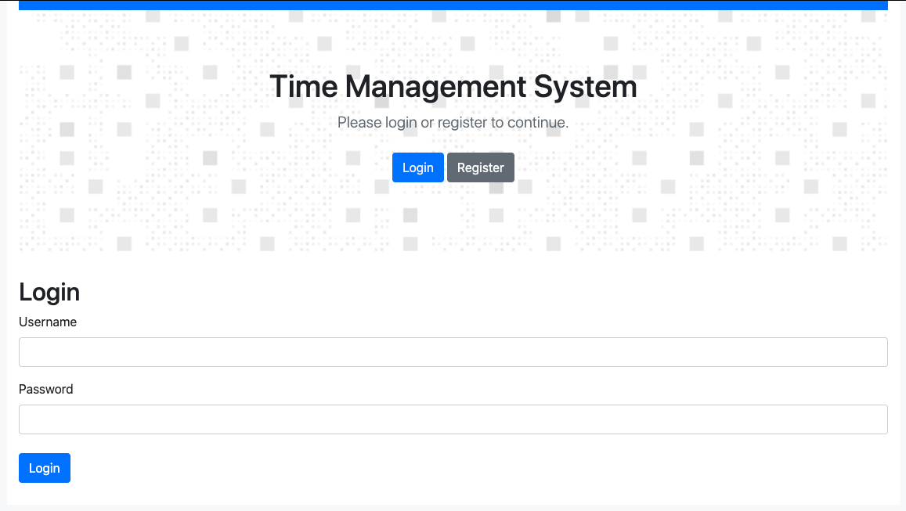

## About

Timesheet management app based on `Django`, `Django-REST Framework` and `VueJs`.

## Application Init
```
rm -f db.sqlite3
rm -r timesheets/migrations
python manage.py makemigrations timesheets
python manage.py migrate
echo "from django.contrib.auth import get_user_model; User = get_user_model(); User.objects.create_superuser('superadmin', 'superadmin@myproject.com', 'password123')" | python manage.py shell
echo "from django.contrib.auth import get_user_model; User = get_user_model(); User.objects.create_user('admin', 'admin@myproject.com', 'password123',is_staff=True)" | python manage.py shell
echo "from django.contrib.auth import get_user_model; User = get_user_model(); User.objects.create_user('user', 'user@myproject.com', 'password123')" | python manage.py shell
python manage.py runserver
```

## Useful commands:
```
Tests:
coverage run --source=timesheets ./manage.py test ; coverage report  

django-admin startapp timesheets
curl -H 'Accept: application/json; indent=4' -u admin:dimsumdim123 http://127.0.0.1:8000/users/

python manage.py shell  
from rest_framework.renderers import JSONRenderer
from rest_framework.parsers import JSONParser
from timesheets.models import Work
from timesheets.serializers import TimesheetSerializer

work = Work(description="Apple", duration=1,workday="2020-10-1")
work.save()
work = Work(description="Cat", duration=2,workday="2020-10-1")
work.save()
seri = TimesheetSerializer(work)__
seri.data

from django.contrib.auth import get_user_model
from pprint import pprint

User = get_user_model()
user=User.objects.create(username="myname",password="apple")
pprint(user)
user = User.objects.get(username="myname")
pprint(user)
user.is_staff = True
user.is_admin = True
user.is_superuser = True
user.save()


user.is_staff = False
user.is_admin = False
user.is_superuser = False
user.save()
```